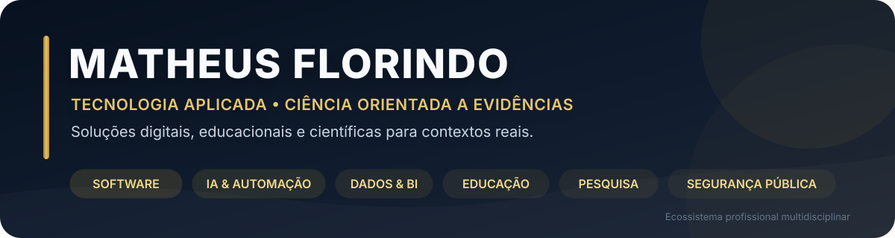

### Pesquisador aplicado · Desenvolvedor de soluções digitais · Educador · Profissional de Segurança Pública

**Conecto experiência de campo, ciência, tecnologia e comunicação para transformar necessidades reais em projetos úteis, documentados e mensuráveis.**

---

## Posicionamento profissional

Atuo na convergência entre **desenvolvimento de software, inteligência artificial, dados, educação, pesquisa aplicada, desempenho humano e segurança pública**.

Minha experiência operacional contribui para identificar problemas concretos. A formação acadêmica e a pesquisa ajudam a definir critérios e avaliar evidências. A tecnologia transforma essas necessidades em aplicações, automações, dashboards, produtos educacionais, documentação técnica e comunicação científica.

> **Proposta de valor:** compreender o contexto, organizar o problema e construir uma solução que possa ser utilizada, avaliada e aprimorada.

Não apresento essas áreas como especialidades desconectadas. Elas formam um **ecossistema profissional multidisciplinar**, no qual cada frente possui público, finalidade e entregas próprias.

---

## Áreas de atuação e entrega

<table>
<tr>
<td width="50%" valign="top">

### Software e produtos digitais

- Aplicações web e interfaces responsivas
- MVPs e protótipos funcionais
- Integrações com APIs e serviços
- Arquitetura de componentes e documentação
- Deploy e evolução de produtos

</td>
<td width="50%" valign="top">

### Inteligência artificial e automação

- Aplicações com modelos de linguagem
- Agentes e fluxos automatizados
- Voice AI, transcrição e síntese de voz
- Automação de tarefas e conteúdo
- Sistemas de apoio à decisão

</td>
</tr>
<tr>
<td width="50%" valign="top">

### Dados e Business Intelligence

- Dashboards e indicadores
- Excel analítico e Power BI
- ETL e tratamento de dados
- Python aplicado à análise
- Relatórios orientados à decisão

</td>
<td width="50%" valign="top">

### Educação, pesquisa e comunicação

- Tecnologia educacional
- Materiais técnicos e didáticos
- Pesquisa e revisão científica
- Comunicação baseada em evidências
- Cursos, guias e produtos de conhecimento

</td>
</tr>
<tr>
<td width="50%" valign="top">

### Segurança pública, APH e desempenho

- Educação para profissionais de segurança
- Primeiros socorros e atendimento pré-hospitalar
- Preparação física e desempenho ocupacional
- Prevenção, saúde e prontidão operacional
- Tradução do conhecimento científico para a prática

</td>
<td width="50%" valign="top">

### Estratégia e desenvolvimento de projetos

- Estruturação de produtos e serviços
- Posicionamento e experiência do usuário
- Organização de ecossistemas digitais
- Marketing educacional e científico
- Planejamento de entregas multidisciplinares

</td>
</tr>
</table>

---

## Ecossistema profissional

| Frente | Papel no ecossistema | Público e aplicação |
|---|---|---|
| **[Núcleo Tático](https://www.nucleotatico.com)** | Educação, tecnologia e preparação estratégica | Concursos, formação e desenvolvimento de profissionais de segurança pública |
| **[Tropa Científica](https://www.tropacientifica.com)** | Tecnologia, IA e comunicação científica | Estudantes, pesquisadores, educadores e profissionais interessados em inovação |
| **[Primeiros Socorros NT](https://github.com/matheusflorindo32/primeiros-socorros-nt)** | Conhecimento aplicado em primeiros socorros e APH | Educação em saúde, SBV, controle de hemorragias e contextos operacionais |
| **[Apex Ops](https://github.com/matheusflorindo32/apex-ops)** | Preparação física e desempenho humano | Atleta tático, prontidão ocupacional, treinamento e prevenção |

---

## Portfólio selecionado

Os projetos abaixo representam diferentes partes da minha atuação. Cada repositório foi escolhido por demonstrar uma entrega concreta, uma competência técnica ou uma aplicação multidisciplinar.

| Projeto | Entrega demonstrada | Competências principais |
|---|---|---|
| **[Núcleo TADS Store](https://github.com/matheusflorindo32/nucleo-storefront)** | E-commerce acadêmico responsivo com autenticação, carrinho persistente, rotas dinâmicas e consumo de API | React, Vite, JavaScript, Context API, React Router, API REST |
| **[ChatGPT Clone DIO](https://github.com/matheusflorindo32/chatgpt-clone-dio)** | Aplicação de chat com frontend, backend protegido e integração com modelo de linguagem | React, Node.js, Express, OpenAI API, Vercel, Railway |
| **[VoiceAI Operacional](https://github.com/matheusflorindo32/voiceai-operacional)** | Pipeline modular de áudio para transcrição, processamento inteligente e síntese de voz | Python, Whisper, LLM, OpenAI, ElevenLabs, automação |
| **[Sales Dashboard Analytics](https://github.com/matheusflorindo32/excel-sales-dashboard-analytics)** | Dashboard executivo para acompanhamento de vendas, KPIs e análise de desempenho | Excel, tabelas dinâmicas, segmentação, indicadores, BI |
| **[Primeiros Socorros NT](https://github.com/matheusflorindo32/primeiros-socorros-nt)** | Repositório educacional sobre primeiros socorros, SBV e atendimento pré-hospitalar | Educação em saúde, documentação, curadoria e pesquisa aplicada |
| **[Combatente Científico](https://github.com/matheusflorindo32/podcast-combatente-cientifico)** | Produção de podcast sobre treinamento tático baseado em evidências utilizando IA generativa | Pesquisa, roteirização, ElevenLabs, edição e divulgação científica |

---

## Diferenciais de atuação

| Dimensão | Como se traduz na prática |
|---|---|
| **Visão de campo** | Compreensão de necessidades operacionais, educacionais e institucionais reais |
| **Base científica** | Busca por evidências, critérios técnicos, referências e avaliação crítica |
| **Execução digital** | Transformação de ideias em protótipos, aplicações, automações e produtos |
| **Comunicação** | Tradução de temas complexos para públicos técnicos, acadêmicos e profissionais |
| **Integração multidisciplinar** | Conexão entre tecnologia, pessoas, desempenho, educação e tomada de decisão |

---

## Formação e base profissional

- **Análise e Desenvolvimento de Sistemas — IFES**, em formação.
- **Educação Física**, em formação, com interesse em desempenho, saúde e populações ocupacionais.
- Formação superior em **Gestão Ambiental** e **Geografia**.
- Participação em pesquisa na área de **Fisiologia Translacional**, com interface entre desempenho humano e segurança pública.
- Estudos e especializações em **inteligência artificial, ciência de dados, Business Intelligence, educação, preparação física e atendimento pré-hospitalar**.
- Profissional da **Polícia Militar do Espírito Santo**, com experiência operacional desde 2013.

---

## Tecnologias e ferramentas

| Categoria | Tecnologias e ferramentas |
|---|---|
| **Desenvolvimento web** | `JavaScript` · `TypeScript` · `React` · `Vite` · `Node.js` · `HTML` · `CSS` |
| **Dados e backend** | `Python` · `PostgreSQL` · `Supabase` · `Excel` · `Power BI` |
| **IA e automação** | `OpenAI API` · `Whisper` · `LLMs` · `n8n` · `ElevenLabs` |
| **Produto e deploy** | `Git` · `GitHub` · `Vercel` · `Railway` · `Lovable` |
| **Pesquisa e conteúdo** | `Obsidian` · `Canva` · documentação técnica · revisão científica |

---

## GitHub em dados

Os cards são arquivos do próprio repositório e são recalculados automaticamente pela API oficial do GitHub.

---

## Gostou do meu trabalho? Talvez eu possa ajudar.

Empresas, instituições, pesquisadores, educadores e equipes podem contar comigo para organizar problemas e desenvolver soluções em diferentes estágios — da definição da ideia ao protótipo, documentação e apresentação.

### Possibilidades de colaboração

- MVPs, aplicações web e protótipos digitais;
- automações e fluxos com inteligência artificial;
- dashboards, indicadores e análise de dados;
- produtos educacionais, cursos, guias e materiais técnicos;
- comunicação científica e transformação de pesquisa em conteúdo;
- soluções para segurança pública, primeiros socorros, desempenho e formação profissional.

**Uma boa parceria começa com um problema bem compreendido. Vamos conversar sobre o que precisa ser construído, melhorado ou comunicado.**

### Aberto a parcerias, projetos, convites acadêmicos e desenvolvimento de soluções.

> **“Não negocie com sua mente.”**  
> Disciplina para executar. Ciência para decidir. Tecnologia para transformar.

