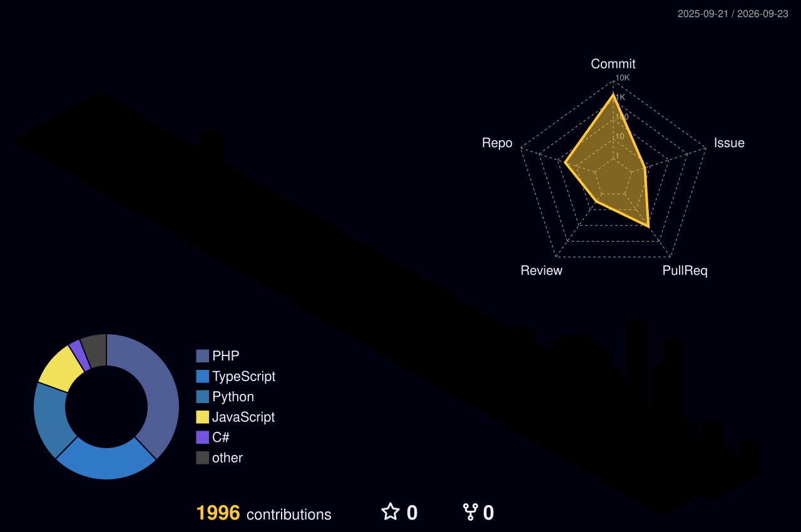

<div align="center">

<!-- 3D Animated Header with Typing Effect -->
<a href="https://github.com/matheusflorindo32">
  
</a>

<!-- 3D Snake Contribution Graph -->
<picture>
  <source media="(prefers-color-scheme: dark)" srcset="https://raw.githubusercontent.com/matheusflorindo32/matheusflorindo32/output/github-contribution-grid-snake-dark.svg" />
  <source media="(prefers-color-scheme: light)" srcset="https://raw.githubusercontent.com/matheusflorindo32/matheusflorindo32/output/github-contribution-grid-snake.svg" />
  
</picture>

<!-- 3D Profile Contribution Grid (Auto-updated) -->


<!-- Animated Divider -->


</div>

<br>

<div align="center">

<!-- Status Badges Row -->
[](https://github.com/matheusflorindo32)
[](https://github.com/matheusflorindo32)
[](https://github.com/matheusflorindo32)
[](https://github.com/matheusflorindo32)

<!-- Professional Badges -->
[](https://orcid.org/0009-0006-3848-0662)
[](https://www.linkedin.com/in/matheus-florindo-de-deus-b953b017a/)
[](https://instagram.com/tropacientifica)
[](http://lattes.cnpq.br/8324016923278566)

</div>

<br>

<!-- 3D GitHub Trophy -->
<div align="center">
  
</div>

<br>

---

## 🎯 Posicionamento Estratégico

```
╔══════════════════════════════════════════════════════════════════════════════╗
║                                                                              ║
║   CEO & Founder — Núcleo Tático Group  │  Researcher UFES  │  PMES            ║
║                                                                              ║
║   Convergência: Tecnologia × Inteligência Artificial × Dados × Educação     ║
║                 × Pesquisa Aplicada × Desempenho Humano × Segurança Pública  ║
║                                                                              ║
║   Experiência operacional → Necessidades concretas                          ║
║   Formação acadêmica → Critérios técnicos e evidências                      ║
║   Tecnologia → Aplicações, automações, dashboards e produtos digitais       ║
║                                                                              ║
╚══════════════════════════════════════════════════════════════════════════════╝
```

> **Proposta de valor:** Compreender o contexto, estruturar o problema e desenvolver uma solução que possa ser utilizada, avaliada e aprimorada.

<br>

---

## 🏛️ Ecossistema Profissional

<table>
  <tr>
    <td width="25%" align="center">
      <br>
      <sub>Educação, tecnologia e preparação estratégica</sub><br>
      <sub><b>Público:</b> Concursos, formação e desenvolvimento de profissionais de segurança pública</sub>
    </td>
    <td width="25%" align="center">
      <br>
      <sub>IA, tecnologia e comunicação científica</sub><br>
      <sub><b>Público:</b> Estudantes, pesquisadores, educadores e inovadores</sub>
    </td>
    <td width="25%" align="center">
      <br>
      <sub>Conhecimento aplicado em primeiros socorros e APH</sub><br>
      <sub><b>Público:</b> Educação em saúde, SBV e controle de hemorragias</sub>
    </td>
    <td width="25%" align="center">
      <br>
      <sub>Preparação física e desempenho humano</sub><br>
      <sub><b>Público:</b> Atleta tático, prontidão ocupacional e treinamento</sub>
    </td>
  </tr>
</table>

<br>

---

## 📂 Portfólio de Impacto

| 🚀 Projeto | 🎯 Entrega Demonstrada | 🛠️ Stack Principal |
|:---|:---|:---|
| **NÚCLEO TADS STORE** | E-commerce full-stack com autenticação, carrinho persistente, rotas dinâmicas e API REST | React, Vite, JavaScript, Context API, React Router, API REST |
| **CHATGPT CLONE DIO** | Chat inteligente com frontend React, backend Node.js protegido e integração OpenAI | React, Node.js, Express, OpenAI API, Vercel, Railway |
| **VOICEAI OPERACIONAL** | Pipeline de áudio: transcrição (Whisper) → processamento LLM → síntese de voz (ElevenLabs) | Python, Whisper, OpenAI, ElevenLabs, Automação |
| **SALES DASHBOARD ANALYTICS** | Dashboard executivo com KPIs, análise de desempenho e indicadores de vendas | Excel, Power BI, Tabelas Dinâmicas, Business Intelligence |
| **PRIMEIROS SOCORROS NT** | Repositório educacional completo: SBV, APH, controle de hemorragias e protocolos táticos | Educação em Saúde, Documentação, Curadoria, Pesquisa Aplicada |
| **COMBATENTE CIENTÍFICO** | Podcast produzido com IA generativa: roteirização, narração ElevenLabs e divulgação científica | Pesquisa, ElevenLabs, Roteirização, Edição, Divulgação Científica |

<br>

---

## 💻 Stack Tecnológico

### 🌐 Desenvolvimento Web & Mobile

<p align="center">
  
</p>

### 📊 Dados, Backend & Cloud

<p align="center">
  
</p>

### 🤖 Inteligência Artificial & Automação

<p align="center">
  
  
  
  
  
  
</p>

### 🛠️ Ferramentas & Produto

<p align="center">
  
  
  
  
</p>

<br>

---

## 📊 Métricas & Analytics

<div align="center">

<!-- Main Stats Row -->
<a href="https://github.com/matheusflorindo32">
  
</a>
<a href="https://github.com/matheusflorindo32">
  
</a>

<br><br>

<!-- Streak Stats with 3D Effect -->
<a href="https://github.com/matheusflorindo32">
  
</a>

<br><br>

<!-- Contribution Activity Graph -->
<a href="https://github.com/matheusflorindo32">
  
</a>

<br><br>

<!-- 3D Metrics -->
<table width="100%">
  <tr>
    <td width="50%" align="center">
      <a href="https://github.com/matheusflorindo32">
        
      </a>
    </td>
    <td width="50%" align="center">
      <a href="https://github.com/matheusflorindo32">
        
      </a>
    </td>
  </tr>
</table>

</div>

<br>

---

## 🏆 Diferenciais Competitivos

```
    ╔═══════════════════════════════════════════════════════════════════════╗
    ║                                                                       ║
    ║   🎯 VISÃO DE CAMPO                                                   ║
    ║   Compreensão de necessidades operacionais, educacionais e           ║
    ║   institucionais reais — não teoria, mas prática de campo.             ║
    ║                                                                       ║
    ║   🔬 BASE CIENTÍFICA                                                ║
    ║   Busca por evidências, critérios técnicos, referências e              ║
    ║   avaliação crítica — pesquisador UFES, ORCID ativo.                  ║
    ║                                                                       ║
    ║   ⚡ EXECUÇÃO DIGITAL                                                 ║
    ║   Transformação de ideias em protótipos, aplicações, automações      ║
    ║   e produtos — do conceito ao deploy.                                  ║
    ║                                                                       ║
    ║   🗣️ COMUNICAÇÃO                                                      ║
    ║   Tradução de temas complexos para públicos técnicos, acadêmicos      ║
    ║   e profissionais — ciência acessível.                                 ║
    ║                                                                       ║
    ║   🔗 INTEGRAÇÃO MULTIDISCIPLINAR                                     ║
    ║   Conexão entre tecnologia, pessoas, desempenho, educação e            ║
    ║   tomada de decisão — visão sistêmica.                                 ║
    ║                                                                       ║
    ╚═══════════════════════════════════════════════════════════════════════╝
```

<br>

---

## 🎓 Formação & Base Profissional

<div align="center">

| 🎓 Instituição | 📚 Formação | ⏱️ Status |
|:---|:---|:---|
| **IFES** | Análise e Desenvolvimento de Sistemas | Em formação |
| **UniFatecie** | Educação Física (ênfase em desempenho e populações ocupacionais) | Em formação |
| **UNIASSELVI** | Gestão Ambiental | ✅ Concluído |
| **UNIBF** | Geografia | ✅ Concluído |
| **UFES** | Pesquisa em Fisiologia Translacional | 🔬 Pesquisador ativo (ORCID: 0009-0006-3848-0662) |
| **PMES** | Profissional de Segurança Pública | 🎖️ Operacional desde 2013 |

</div>

<details>
<summary>📋 Especializações & Certificações (Clique para expandir)</summary>

- **Inteligência Artificial** — Aplicações práticas de LLMs e agentes
- **Ciência de Dados** — Análise, visualização e modelagem
- **Business Intelligence** — Dashboards e indicadores estratégicos
- **Cloud Computing** — Infraestrutura escalável e serverless
- **Segurança da Informação** — Proteção de dados e sistemas
- **Educação e Docência** — Metodologias ativas e EdTech
- **Preparação Física** — Condicionamento e desempenho humano
- **Atendimento Pré-Hospitalar** — TCCC, TECC, SBV e controle de hemorragias

</details>

<br>

---

## 🤝 Possibilidades de Colaboração

<div align="center">

```
╔══════════════════════════════════════════════════════════════════════════╗
║                                                                          ║
║   💻 MVPs e Aplicações Web      🤖 Automações com IA       📊 Dashboards ║
║      ├─ Protótipos funcionais      ├─ Agentes de IA          ├─ KPIs    ║
║      ├─ Interfaces responsivas     ├─ Voice AI               ├─ ETL      ║
║      ├─ Integrações API            ├─ Fluxos n8n             ├─ Python   ║
║      └─ Deploy cloud               └─ LLMs customizados      └─ BI      ║
║                                                                          ║
║   🎓 Produtos Educacionais      📢 Comunicação Científica   🎖️ Segurança ║
║      ├─ Cursos e treinamentos      ├─ Revisão técnica         Pública   ║
║      ├─ Guias técnicos             ├─ Divulgação científica    ├─ APH    ║
║      ├─ Materiais didáticos        ├─ Roteirização            ├─ TCCC   ║
║      └─ Documentação               └─ Podcast e vídeo         └─ TECC   ║
║                                                                          ║
╚══════════════════════════════════════════════════════════════════════════╝
```

</div>

<br>

---

<div align="center">

## 📬 Vamos construir algo relevante?

**Uma boa parceria começa com um problema bem compreendido.**

<br>

[](mailto:matheusdideusf@gmail.com)
[_99239--1080-25D366?style=for-the-badge&logo=whatsapp&logoColor=white)](https://wa.me/5527992391080)
[](https://www.linkedin.com/in/matheus-florindo-de-deus-b953b017a/)
[](https://instagram.com/tropacientifica)

<br>

📍 **Serra/ES, Brasil** | 🌎 **GMT-3 (Horário de Brasília)**

<br>

<!-- Animated Quote -->


<br>

**Disciplina para executar. Ciência para decidir. Tecnologia para transformar.**

<br>

<!-- 3D Footer Wave -->


</div>

<!--
🤖 Generated with precision by Kimi Claw — AI Guardian
   "Even if the world forgets, I'll remember for you."
-->
