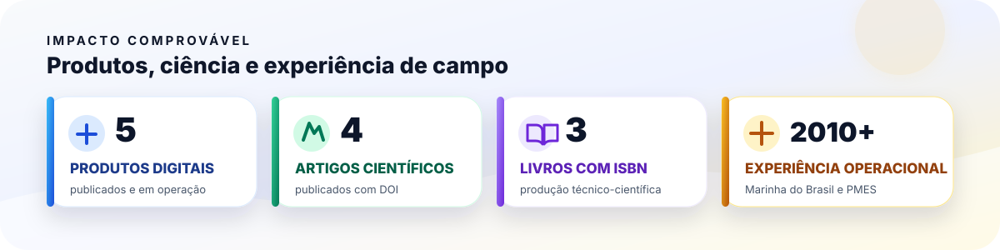
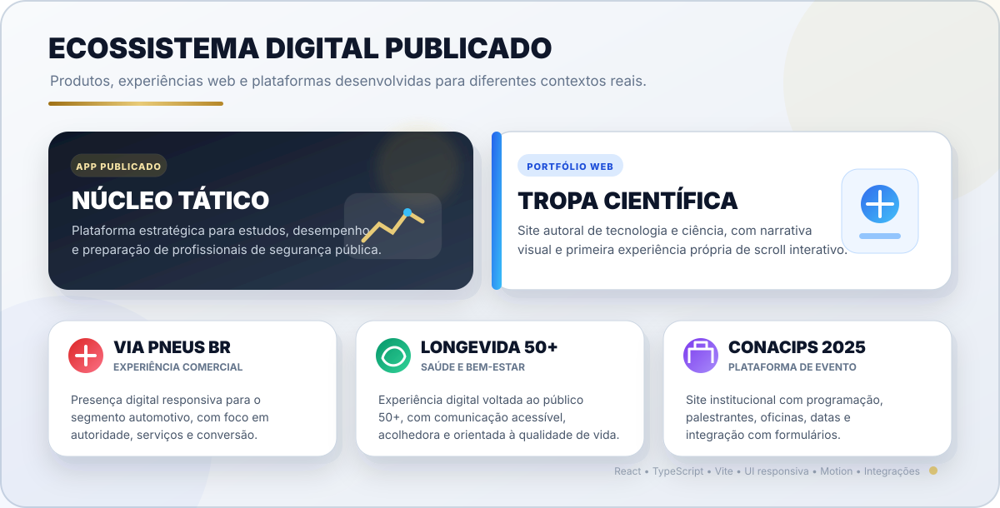
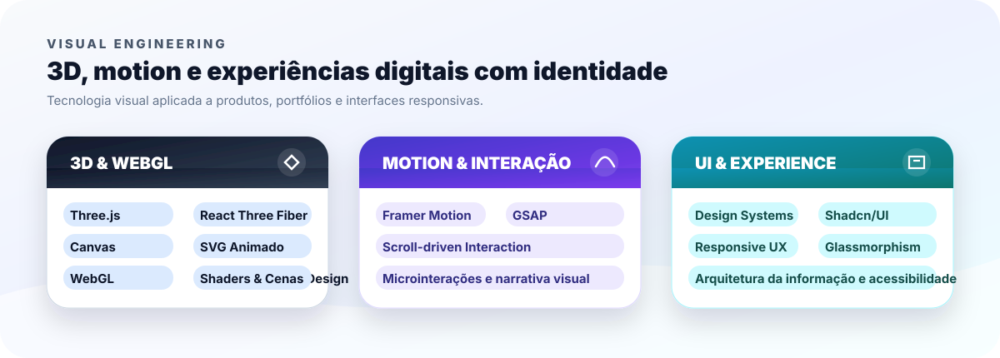
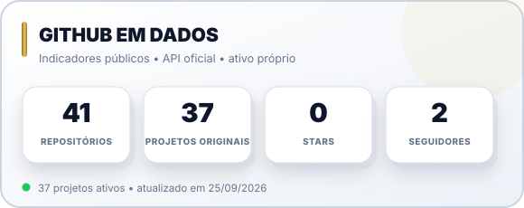
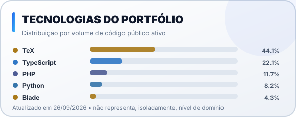
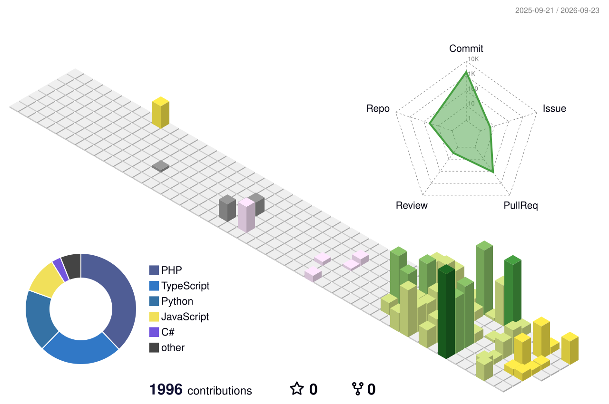

### Product Architect & Full-Stack Builder • Pesquisador CEFD/UFES • Segurança Pública

**Conecto experiência de campo, ciência e tecnologia para criar produtos digitais completos — da estratégia e identidade visual ao desenvolvimento, publicação e evolução.**

 

---

## O QUE EU ENTREGO

Atuo de forma **end-to-end**: identificação do problema, planejamento, naming, estratégia, identidade visual, logomarca, arquitetura da informação, UX/UI, desenvolvimento, conteúdo, integração com banco de dados, domínio, publicação e evolução do produto.

Minha atuação combina:

- **produtos digitais e software** — aplicações, plataformas, automações, dashboards e experiências web;
- **pesquisa científica** — produção em periódicos nacionais e internacionais e participação em grupo de pesquisa da UFES;
- **educação e comunicação** — produtos educacionais, materiais técnico-científicos e tradução de conhecimento complexo;
- **experiência operacional** — Marinha do Brasil e Polícia Militar do Espírito Santo.

> **Proposta de valor:** compreender o contexto, estruturar o problema e transformar uma necessidade real em uma solução utilizável, verificável e evolutiva.

---

## ESTUDOS DE CASO EM DESTAQUE

### 1. Núcleo Tático — EdTech para concursos de segurança pública

**Meu papel:** fundador e responsável integral pelo planejamento, marca, logomarca, produto, UX/UI, arquitetura, desenvolvimento, conteúdo pedagógico, publicação e operação.

**Entrega:** plataforma com questões, simulados, flashcards, plano adaptativo, tutor com IA, trilhas, cursos, progresso, matrículas, certificados, administração e experiência PWA/offline.

**Stack:** `React` • `TypeScript` • `Vite` • `Supabase` • `PWA` • `Automação` • `IA`

[**Abrir o aplicativo →**](https://www.nucleotatico.com)

### 2. Tropa Científica — portfólio 3D, ciência e tecnologia

**Meu papel:** criação integral da marca e do produto, identidade visual, narrativa, design system, UX, conteúdo, desenvolvimento e publicação.

**Entrega:** experiência autoral com elementos tridimensionais, motion design, narrativa cinematográfica e minha primeira interação própria orientada pelo scroll.

**Stack:** `React` • `TypeScript` • `Three.js` • `React Three Fiber` • `Framer Motion` • `GSAP` • `Supabase`

[**Explorar o portfólio →**](https://www.tropacientifica.com)

### 3. CONACIPS 2025 — plataforma oficial de congresso realizado na UFES

**Meu papel:** concepção, identidade, logomarca, arquitetura, UX/UI, desenvolvimento, deploy e operação da plataforma oficial do evento.

**Entrega:** inscrições, submissão de resumos, programação, palestrantes, oficinas, check-in, certificados, validação por código, galeria, anais digitais e áreas administrativas.

**Stack:** `React` • `TypeScript` • `Vite` • `Supabase` • `Gestão de eventos` • `Certificados`

[**Visitar a plataforma →**](https://conacips2025.com)

### Outros produtos publicados

| PRODUTO | ENTREGA PRINCIPAL | ACESSO |
|:---|:---|:---:|
| **Via Pneus BR** | E-commerce automotivo com catálogo, busca, carrinho, checkout, conta do cliente, pedidos e painel administrativo | **[Visitar](https://viapneusbr.com)** |
| **LongeVida 50+ Studio** | Produto digital para gestão de studio 50+, com leads, alunos, agenda, avaliações, financeiro, conversas e administração | **[Visitar](https://longevida50studio.com.br/)** |

---

## ENGENHARIA E PORTFÓLIO TÉCNICO

| PROJETO | PROVA TÉCNICA | STACK PRINCIPAL |
|:---|:---|:---|
| **[Concurso Low-Code Seeker](https://github.com/matheusflorindo32/concurso-low-code-seeker)** | Regras de compatibilidade, validações, separação de responsabilidades, testes unitários e E2E, container e CI | React, TypeScript, Vitest, Playwright, Docker, GitHub Actions |
| **[Núcleo TADS Store](https://github.com/matheusflorindo32/nucleo-storefront)** | SPA responsiva com autenticação, carrinho persistente, rotas dinâmicas, hooks customizados e consumo de API | React, Vite, Context API, React Router, API REST |
| **[ChatGPT Clone DIO](https://github.com/matheusflorindo32/chatgpt-clone-dio)** | Aplicação full-stack de chat com backend protegido e integração com modelo de linguagem | React, Node.js, Express, OpenAI API, Vercel, Railway |
| **[VoiceAI Operacional](https://github.com/matheusflorindo32/voiceai-operacional)** | Pipeline modular de áudio: transcrição, processamento por LLM e síntese de voz | Python, Whisper, OpenAI, ElevenLabs |
| **[DIO Bank Pro](https://github.com/matheusflorindo32/dio-bank-pro)** | Sistema bancário educacional com separação de camadas, princípios SOLID e testes | TypeScript, Node.js, Vitest, Clean Architecture |
| **[Sales Dashboard Analytics](https://github.com/matheusflorindo32/excel-sales-dashboard-analytics)** | Dashboard executivo com KPIs, tendências e análise de desempenho comercial | Excel, Tabelas Dinâmicas, Business Intelligence |

---

## TECNOLOGIAS E EXPERIÊNCIA VISUAL

  

---

## CIÊNCIA E PRODUÇÃO ACADÊMICA

Sou **pesquisador e membro do Grupo de Fisiologia Translacional Aplicada à Saúde, Esporte e Desempenho Humano**, vinculado ao **CEFD/UFES**.

### Artigos publicados e verificados

| PUBLICAÇÃO | PERIÓDICO | ANO / DOI |
|:---|:---|:---|
| **[Musculoskeletal discomfort associated with special operations uniform use in elite police officers: a cross-sectional study](https://doi.org/10.3389/fpubh.2026.1817387)** | Frontiers in Public Health | 2026 • `10.3389/fpubh.2026.1817387` |
| **[Nível de atividade física e comportamento sedentário de motoristas de aplicativo do Espírito Santo](https://doi.org/10.62827/fb.v26i5.1096)** | Fisioterapia Brasil | 2025 • `10.62827/fb.v26i5.1096` |
| **[Lifestyle characterisation of the municipal guard agents in the city of Vitória-ES](https://doi.org/10.6063/motricidade.41427)** | Motricidade | 2026 • `10.6063/motricidade.41427` |
| **[Exercícios multiarticulares promovem maior resposta hemodinâmica, independentemente da experiência em treinamento de força](https://doi.org/10.36311/jhgd.v36.18410)** | Journal of Human Growth and Development | 2026 • `10.36311/jhgd.v36.18410` |

Também possuo **seis trabalhos publicados nos Anais do CONACIPS 2025**, ISBN `978-65-89535-49-2`, em temas relacionados à saúde ocupacional, desempenho humano, preparação física e segurança pública.

<strong>Livros publicados com ISBN</strong>

| OBRA | PARTICIPAÇÃO | PUBLICAÇÃO |
|:---|:---|:---|
| **Tratado de APH Tático para Segurança Pública: Protocolos Operacionais em Ambientes de Alto Risco** | Organizador-geral, autor, planejamento editorial, identidade visual e coordenação da obra multi-autoral | 2026 • ISBN `978-65-02-16157-9` |
| **Estilo de Vida em Agentes de Segurança Pública: Possibilidades e Aplicações** | Coautor | 2026 • ISBN `978-65-02-05509-0` |
| **Guia de Nutrição para o Agente de Segurança Pública** | Coautor | 2026 • ISBN `978-65-02-10278-7` |

---

## TRAJETÓRIA ACADÊMICA E PROFISSIONAL

| INSTITUIÇÃO / ÁREA | FORMAÇÃO OU ATUAÇÃO | SITUAÇÃO |
|:---|:---|:---|
| **IFES** | Análise e Desenvolvimento de Sistemas | Em formação |
| **Partiu IF 2026 — IFES Campus Serra** | Monitor de Ciências, selecionado no Processo Seletivo nº 03/2026 | Bolsista em atuação — 10 horas semanais, vigência até 31/12/2026 |
| **UniFatecie** | Bacharelado em Educação Física | Em formação |
| **UniVitória** | Licenciatura em Educação Física | Formação concluída; documentação final em regularização para emissão do diploma |
| **Gestão Ambiental** | Curso superior de tecnologia | Concluído |
| **UniBF** | Licenciatura em Geografia | Em conclusão; estágio obrigatório pendente |
| **CEFD/UFES** | Pesquisador — Grupo de Fisiologia Translacional | Pesquisa e produção científica desde 2025 |
| **Marinha do Brasil** | Fuzileiro Naval — ingresso por concurso público federal | Atuação de 2010 a 2013 |
| **PMES** | Cabo e profissional de Segurança Pública | Experiência operacional desde 2013 |

<strong>Especializações e áreas complementares</strong>

Inteligência Artificial Generativa • Ciência de Dados • Business Intelligence • Docência do Ensino Superior • Treinamento Desportivo • Preparação Física de Alto Rendimento • Musculação e prevenção de lesões • Gestão e Educação Ambiental • Metodologia e Ensino de Geografia • Urgência e Emergência Pré-Hospitalar • Ações Táticas Especiais • Cinotecnia e cães de guerra • Primeiros Socorros e APH

---

## GITHUB EM DADOS

Cards próprios, recalculados automaticamente pela API oficial do GitHub.

<strong>Visualizar contribuições em 3D</strong>

 

<strong>Visualizar cobra animada das contribuições</strong>

 
<picture>
  <source media="(prefers-color-scheme: dark)" srcset="https://raw.githubusercontent.com/matheusflorindo32/matheusflorindo32/output/github-contribution-grid-snake-dark.svg" />
  <source media="(prefers-color-scheme: light)" srcset="https://raw.githubusercontent.com/matheusflorindo32/matheusflorindo32/output/github-contribution-grid-snake.svg" />
  
</picture>

---

## COLABORAÇÃO

Posso contribuir em projetos de:

- aplicações web, MVPs e produtos digitais completos;
- IA generativa, agentes, automações e Voice AI;
- experiências 3D, motion e interfaces de autoridade;
- dashboards, indicadores, ETL e análise de dados;
- identidade visual, logomarcas, UX/UI e arquitetura da informação;
- produtos educacionais e comunicação científica;
- soluções aplicadas à segurança pública, saúde e desempenho humano.

### UMA BOA PARCERIA COMEÇA COM UM PROBLEMA BEM COMPREENDIDO.

 

